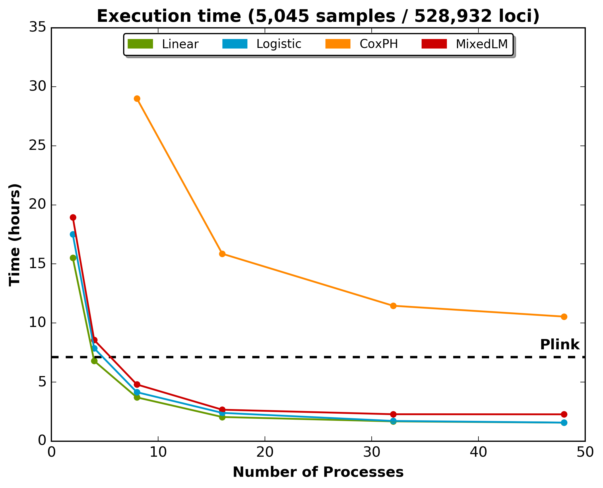

.. _stats-exec-time:

Statistical Analysis Execution Time
====================================

Adequate execution time is of importance when considering the analysis of
important amount of data (such as is generated by a genome-wide imputation
project). Some of the most common used analysis (such as linear and logistic
regressions) are pretty fast, but some (such as the mixed linear models and the
Cox's proportional hazard) are computationally intensive.

We have optimized the mixed linear model analysis to significantly decrease
computation time. Using a two-step approach (as described by Sikorska *et al.*,
2015 [doi: `10.1038/ejhg.2015.1
<http://www.nature.com/ejhg/journal/v23/n10/abs/ejhg20151a.html>`_]), the
execution time is comparable to a simple linear regression. Prior to
optimization, the analysis of chromosome 2 was performed in 53 hours for 33
sub-analysis with 6 threads each (which corresponds to 198 threads).

The following figure shows the execution time for a typical imputation analysis
of chromosome 2, imputed for 5,045 samples. Chromosome 2 was composed a total
of 1,170,797 loci, where 961,019 were of sufficient quality, and 528,932 had a
MAF higher than 1%. The black dashed line is the execution time for Plink.

.. note::

   On some installation, when executing the analysis with *n* threads, the
   *OPENBLAS* automatically uses all the CPUs for each thread, such that the
   load quickly increases to *n* times the number of CPUs, slowing considerably
   the analysis.

   To avoid this, always export the following environment variable and specify
   the total number of threads using the ``--nb-process`` option.

   .. code-block:: bash

      export OPENBLAS_NUM_THREADS=1

We are planning to optimize the Cox's proportional hazard regression in the
near future, if such an optimization is possible.
