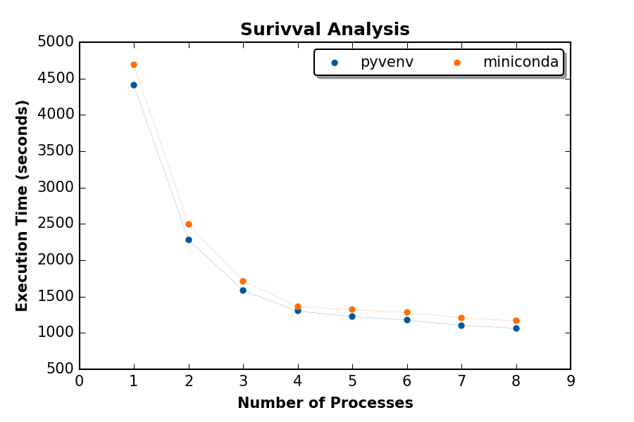

.. contents:: Quick navigation
   :depth: 2

Survival analysis
==================

A popular technique to perform a survival analysis (regression) is the Cox's
model. It is possible to perform such an analysis using imputation data (dosage
format), where each imputed genotypes varies between 0 and 2 (inclusively). A
value close to 0 means that a homozygous genotype of the most frequent allele
is the most probable. A value close to 2 means that a homozygous genotype of
the rare allele is the most probable. Finally, a value close to 1 means that a
heterozygous genotype is the most probable.

We suppose that you have followed the main :ref:`genipe-tut-page`. The
following command will create the working directory for this tutorial.

.. code-block:: bash

   mkdir -p $HOME/genipe_tutorial/survival

.. _survival-tut-input-files:

Input files
------------

Imputed genotypes
^^^^^^^^^^^^^^^^^^

After running the :py:mod:`genipe` pipeline, the imputed genotypes files will
have the ``.impute2`` or ``.impute2.gz`` extension Those files will be located
in the ``final_impute2`` directories of each chromosomes. There should be one
*impute2* file per chromosome (see the
:ref:`genipe-tut-output-files-final_impute2` section in the main
:ref:`genipe-tut-page`). These files consist of the imputed genotypes required
to perform the analysis.

The general structure of the file contains the following columns (which are
space delimited): the chromosome, the name of the marker, its position and its
two alleles. The subsequent columns correspond to the probabilities of each
genotype (hence, there are three columns per sample). The first value
correspond to the probability of being homozygous of the first allele. The
second value correspond to the probability of being heterozygous. Finally, the
third value correspond to the probability of being homozygous of the second
allele. The following example shows two lines of the *impute2* file.

.. code-block:: text

    21 rs376366718:10000302:A:G 10000302 A G 0.986 0.014 0 1 0 0 1 0 0 ...
    21 21:10002805:C:T 10002805 C T 0.254 0.736 0.010 0.810 0.188 0.002 0.800 0.195 0.005 ...

Samples file
^^^^^^^^^^^^^

This file is generated by :py:mod:`genipe` and has the ``.sample`` extension.
There should be one sample file per chromosome (see the
:ref:`genipe-tut-output-files-final_impute2` section in the main
:ref:`genipe-tut-page`). These files greatly resembles the *Plink* ``fam``
file. Specifically, it contains the samples that are included in the *impute2*
file (with **the same order**). It is needed to correctly interpret the sample
described by the *impute2* file. The format is as follow:

.. code-block:: text

   ID_1 ID_2 missing father mother sex plink_pheno
   0 0 0 D D D B
   1341 NA06985 0 0 0 2 -9
   1341 NA06991 0 NA06993 NA06985 2 -9
   1341 NA06993 0 0 0 1 -9
   ...

The first two rows are part of the format and should be as is.

.. warning::

   The column ``ID_2`` should contain **unique** sample identification numbers,
   since the analysis will only consider the ``ID_2`` (which correspond to the
   sample ID in the *Plink* file) to correctly match the samples and the
   imputed genotypes.

Phenotype file
^^^^^^^^^^^^^^^

This file describes the variables used to perform the survival regression. The
file is *tab* separated and contains one row per sample, one column per
variable. Two variables are required: the time to event, and the event (``1``,
the event **was observed**, and ``0``, the event **was not observed**
(censored)).

The following is an example of a phenotype file:

.. code-block:: text

   SampleID	TTE	Event	Age	Var1	Gender
   NA06985	425.5006566841411	1	53	48.01043142060001	2
   NA06993	553.6637748799277	1	47	23.7615117523	1
   NA06994	569.4273004275149	0	48	20.2946857226	1

We provide a *dummy* phenotype file (where values, except for ``Gender``, were
randomly generated). The following command should download the phenotype file.

.. code-block:: bash

   cd $HOME/genipe_tutorial/survival

   wget http://pgxcentre.github.io/genipe/_static/tutorial/phenotypes_survival.txt.bz2
   bunzip2 phenotypes_survival.txt.bz2

.. note::

   Note that the gender is encoded such that males are ``1`` and females are
   ``2``. Samples with missing gender (encoded as ``0``) will be excluded only
   if gender is in the covariable list.

.. warning::

   The sample identification numbers should match the ones in the sample file
   (see above). Those numbers should be unique for each sample. Only the
   samples that are **both** in the sample and phenotype files will be kept for
   analysis. The order of the samples in the phenotype file is not important.

Sites to extract (optional)
^^^^^^^^^^^^^^^^^^^^^^^^^^^^

This file (which is optional) should contain a list of site (one identification
number per line) to keep for the analysis. This file might be the
``.good_sites`` file automatically generated by :py:mod:`genipe` (see the
:ref:`genipe-tut-output-files-final_impute2` section in the main
:ref:`genipe-tut-page`).

.. _survival-tut-execute:

Executing the analysis
-----------------------

If you followed the :ref:`genipe-tut-page`, the following commands should
execute the survival analysis.

.. code-block:: bash

   cd $HOME/genipe_tutorial/survival

   imputed-stats cox \
       --impute2 ../genipe/chr22/final_impute2/chr22.imputed.impute2.gz \
       --sample ../genipe/chr22/final_impute2/chr22.imputed.sample \
       --pheno phenotypes_survival.txt \
       --extract-sites ../genipe/chr22/final_impute2/chr22.imputed.good_sites \
       --nb-process 4 \
       --nb-lines 6000 \
       --gender-column Gender \
       --covar Age,Var1,Gender \
       --sample-column SampleID \
       --time-to-event TTE \
       --event Event

For more information about the arguments and options, see the
:ref:`survival-tut-usage` section. The number of process to use might differ
according to the installation type and to the computer/server. See the
:ref:`survival-tut-execution-time` section for more information.

.. _survival-tut-output-files:

Output files
-------------

There will be two output files: ``.cox.dosage`` will contain the statistics,
and ``.log`` will contain the execution log.

``.cox.dosage`` file
^^^^^^^^^^^^^^^^^^^^^

This file contains the results from the survival analysis. It shows the
following information:

* ``chr``: the chromosome.
* ``pos``: the position on the chromosome.
* ``snp``: the name of the marker.
* ``major``: the major allele.
* ``minor``: the minor allele.
* ``maf``: the frequency of the minor allele.
* ``n``: the number of samples that were used for this marker.
* ``coef``: the coefficient.
* ``se``: the standard error.
* ``lower``: the lower value of the 95% confidence interval.
* ``upper``: the upper value of the 95% confidence interval.
* ``z``: the *z*-statistic.
* ``p``: the *p*-value.

.. note::

   By default, the statistics are computed only for markers with a minor allele
   frequency of 1% and higher. Markers with lower MAF will have ``NA`` values.
   To modify this behavior, use the ``--maf`` option.

.. _survival-tut-usage:

Usage
------

The following command will display the documentation for the survival analysis
in the console:

.. code-block:: console

   $ imputed-stats cox --help
   usage: imputed-stats cox [-h] [-v] [--debug] --impute2 FILE --sample FILE
                            --pheno FILE [--extract-sites FILE] [--out FILE]
                            [--nb-process INT] [--nb-lines INT] [--chrx]
                            [--gender-column NAME] [--scale INT] [--prob FLOAT]
                            [--maf FLOAT] [--covar NAME] [--categorical NAME]
                            [--missing-value NAME] [--sample-column NAME]
                            [--interaction NAME] --time-to-event NAME --event
                            NAME

   Performs a survival regression on imputed data using Cox's proportional hazard
   model. This script is part of the 'genipe' package, version 1.2.2).

   optional arguments:
     -h, --help            show this help message and exit
     -v, --version         show program's version number and exit
     --debug               set the logging level to debug

   Input Files:
     --impute2 FILE        The output from IMPUTE2.
     --sample FILE         The sample file (the order should be the same as in
                           the IMPUTE2 files).
     --pheno FILE          The file containing phenotypes and co variables.
     --extract-sites FILE  A list of sites to extract for analysis (optional).

   Output Options:
     --out FILE            The prefix for the output files. [imputed_stats]

   General Options:
     --nb-process INT      The number of process to use. [1]
     --nb-lines INT        The number of line to read at a time. [1000]
     --chrx                The analysis is performed for the non pseudo-autosomal
                           region of the chromosome X (male dosage will be
                           divided by 2 to get values [0, 0.5] instead of [0, 1])
                           (males are coded as 1 and option '--gender-column'
                           should be used).
     --gender-column NAME  The name of the gender column (use to exclude samples
                           with unknown gender (i.e. not 1, male, or 2, female).
                           If gender not available, use 'None'. [Gender]

   Dosage Options:
     --scale INT           Scale dosage so that values are in [0, n] (possible
                           values are 1 (no scaling) or 2). [2]
     --prob FLOAT          The minimal probability for which a genotype should be
                           considered. [>=0.9]
     --maf FLOAT           Minor allele frequency threshold for which marker will
                           be skipped. [<0.01]

   Phenotype Options:
     --covar NAME          The co variable names (in the phenotype file),
                           separated by coma.
     --categorical NAME    The name of the variables that are categorical (note
                           that the gender is always categorical). The variables
                           are separated by coma.
     --missing-value NAME  The missing value in the phenotype file.
     --sample-column NAME  The name of the sample ID column (in the phenotype
                           file). [sample_id]
     --interaction NAME    Add an interaction between the genotype and this
                           variable.

   Cox's Proportional Hazard Model Options:
     --time-to-event NAME  The time to event variable (in the pheno file).
     --event NAME          The event variable (1 if observed, 0 if not observed)

.. _survival-tut-execution-time:

Execution time
---------------

The following figure shows the approximate execution time for different number
of processes (the ``--nb-process`` option) with different installation methods
(*pyvenv* in blue, versus *miniconda* in orange). This analysis was performed
on a computer with an *Intel(R) Core(TM) i7-3770 CPU @ 3.40GHz* (8 cores) and
16Go of RAM. The analysis contained the 195,473 imputed markers and 90 samples
from the previous command (where phenotypes were available for only 60 of the
samples). Each test was performed only one time (no repetition).

.. _survival_exec_time:

.. _survival-tut-comparison:

Results comparison
-------------------

The survival analysis results from :py:mod:`genipe` and *JMP Genomics* were
compared for validity. The following figure shows the comparison for, from left
to right, the coefficients, the standard errors and the *p*-values. The *x*
axis shows the results from :py:mod:`genipe`, and the *y* axis shows the
results for *JMP Genomics*. This comparison includes 48,127 "good" imputed
markers with a MAF higher or equal to 15%, analyzed for 60 samples (*i.e*
results from this tutorial). Note that for this comparison, the **probability
threshold** (``--prob``) **was changed from 0.9 to 0** to *imitate* *JMP
Genomics* analysis (see note below for more information).

.. note::

   Only markers with minor allele frequency (MAF) higher or equal to 15% were
   compared, since markers with lower MAF might have convergence issues (*e.g.*
   all exposed samples are all cases *or* all controls). In that case, the
   coefficient is large.

.. figure:: ../_static/images/Survival_Diff_Prob0.png
   :align: center
   :width: 100%
   :alt: Survival analysis comparison between genipe and JMP Genomics

.. note::

   The sign of the coefficients might be different when comparing
   :py:mod:`genipe` to *GMP Genomics*, since :py:mod:`genipe` computes the
   statistics on the rare allele, while *JMP Genomics* computes them on the
   second (alternative) allele. The alternative allele might not always be the
   rarest.

.. note::

   By default, :py:mod:`genipe` excludes samples with a maximum probability
   lower than 0.9 (the ``--prob`` option), while *JMP Genomics* keeps all the
   samples for the analysis. In order to get the same results as *JMP
   Genomics*, the analysis must be done with a probability threshold of 0
   (*i.e.* ``--prob 0``, keeping all imputed genotypes including those with
   poor quality). This is what was done for the previous figure.

   The following figure shows the comparison between *JMP Genomics* and
   :py:mod:`genipe` for the same analysis, but using the default probability
   threshold of 0.9 (excluding imputed genotypes with poor quality). Hence,
   48,045 markers were compared.

   .. figure:: ../_static/images/Survival_Diff.png
      :align: center
      :width: 100%
      :alt: Survival analysis comparison between genipe and JMP Genomics

